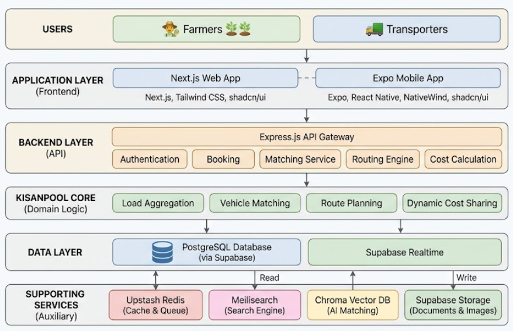
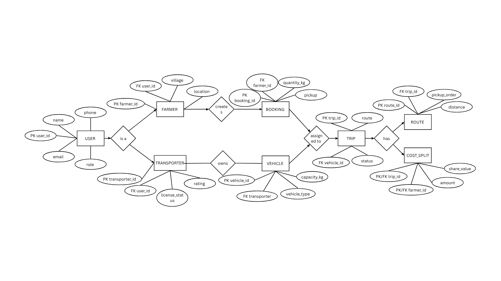
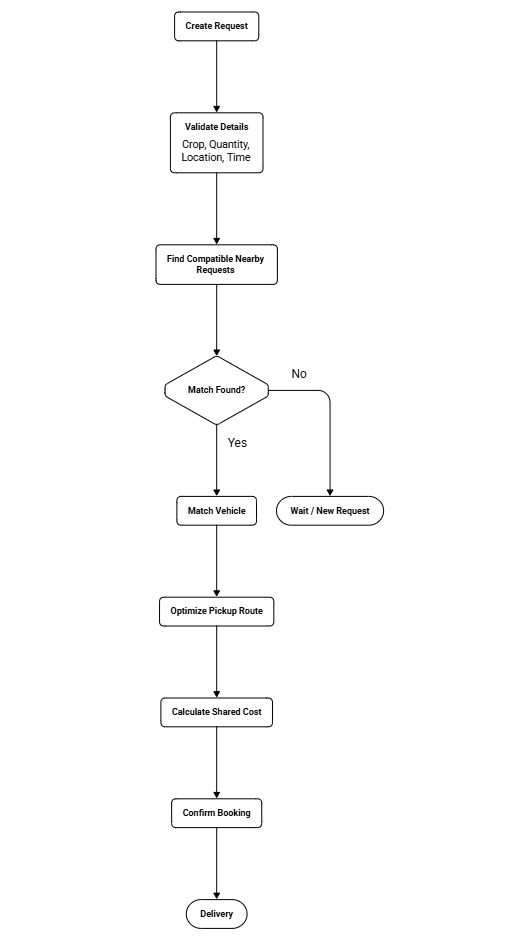
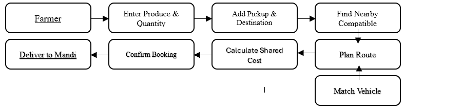
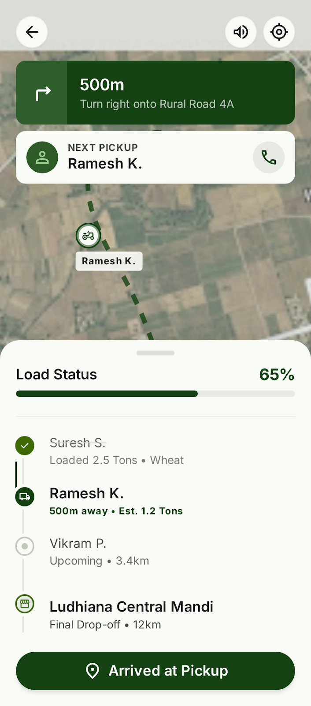

# KisanPool - Agricultural Logistics Platform


**KisanPool** is a comprehensive agricultural logistics platform designed to connect farmers with vehicle owners, optimizing the transportation of agricultural produce. The platform facilitates seamless transport requests, intelligent vehicle matching, and fair cost-sharing mechanisms.

## Table of Contents

1. [What KisanPool Is](#1-what-kisanpool-is)
2. [What's Implemented in This Repo Right Now](#2-whats-implemented-in-this-repo-right-now)
3. [Known Limitations](#3-known-limitations)
4. [AI Assistant (Planned)](#4-ai-assistant-planned)
5. [What's Implemented vs Planned](#5-whats-implemented-vs-planned)
6. [Tech Stack Actually Used](#6-tech-stack-actually-used)
7. [How to Run It Locally](#7-how-to-run-it-locally)
8. [Project Structure](#8-project-structure)
9. [Main End-to-End Flow](#9-main-end-to-end-flow)
10. [What's Planned Next](#10-whats-planned-next)
11. [System Architecture](#11-system-architecture)
12. [System Diagrams](#12-system-diagrams)
13. [Application Screens](#13-application-screens)

## 1. What KisanPool Is

Small and marginal farmers in India often struggle to arrange transport for their harvest: trucks are scarce at harvest time, and individual loads rarely fill a vehicle, so farmers overpay for half-empty trips. KisanPool is a prototype that matches a farmer's transport request with a nearby available vehicle that has the capacity to carry the load, and splits the trip cost between the farmer and the driver.

An AI-assisted interface ("Servom AI") is part of the project concept — intended to let farmers create and manage transport requests by speaking or typing in Indian regional languages. It is **planned, not implemented** (see [Section 4](#4-ai-assistant-planned)).

## 2. What's Implemented in This Repo Right Now

All features below were verified by running the server and exercising the flow over HTTP.

- **Transport request flow (end-to-end, working):**
  1. Farmer submits a transport request: crop, quantity (kg), pickup and drop-off coordinates/addresses, preferred date.
  2. The system loads available vehicles and keeps only those whose capacity can carry the requested quantity.
  3. Each compatible vehicle gets a **match score**: 60% proximity (vehicle-to-pickup distance, haversine formula) and 40% capacity utilization (request quantity / vehicle capacity).
  4. The top 3 matches are returned with computed trip distance, total cost (`distanceKm × ratePerKm`), and the split: **60% farmer / 40% driver**.
  5. Accepting a match creates a `Match` record (`ACCEPTED`), marks the request `MATCHED`, and sets the vehicle unavailable.

- **API server** (`apps/server`): Express 5 + tRPC v11 on `http://localhost:3000`. Procedures: `healthCheck`, `transport.createRequest`, `transport.findMatches`, `transport.acceptMatch`, `transport.getMatch`, `transport.seedVehicles`.

- **Data layer** (`packages/db`): Prisma ORM on a local SQLite file via the libsql driver adapter. Models: `TransportRequest`, `Vehicle`, `Match`; enums `RequestStatus`, `VehicleType`, `MatchStatus`. Data persists on disk across restarts.

- **Mobile app** (`apps/native`): Expo / React Native app with a "New Request" form and a "Matches" screen that lists each vehicle's score, distance, and cost split and lets the farmer accept a match. It talks to the server through a tRPC batch link. The app type-checks; its runtime was **not verified** here (no emulator/device in the build environment).

**AI interaction implemented: none.** There is no Servom AI integration, no LLM/voice/speech library, no translation or language-detection code, and no AI-related API keys in the repository. All AI capability is planned.

## 3. Known Limitations

These are acknowledged in the current implementation:

- **Capacity filtering uses a hardcoded table, not the stored value.** `vehicleCapacityMatch` (packages/api/src/routers/transport.ts) filters vehicles using a hardcoded `vehicleType → capacityKg` map, while the match score uses the `capacityKg` column stored in the `Vehicle` model. The two sources of truth are consistent for the seeded demo data but can diverge.
- **`npm install` requires `--legacy-peer-deps`.** A peer-dependency conflict between `heroui-native` and `react-native-gesture-handler` breaks a plain install.
- **No automated test suite.** Matching and cost-split functions are verified manually over HTTP, not by CI tests.
- **Unused enum statuses.** `RequestStatus` and `MatchStatus` define transitions (`IN_TRANSIT`, `DELIVERED`, `CANCELLED`, `PROPOSED`, `REJECTED`) that no code currently performs; only `PENDING`, `MATCHED`, and `ACCEPTED` are used.
- **Scaffold boilerplate in the UI.** The Home tab still renders the template text "Tab One" and `two.tsx` renders "TabTwo".
- **Native app runtime unverified.** The app compiles and type-checks but has not been run on an emulator/device in the build environment.

## 4. AI Assistant (Planned)

**The problem.** Many farmers are more comfortable speaking or communicating in their regional language than navigating conventional application menus and forms.

**The concept.** As described in the project brief, KisanPool intends to offer an AI-assisted interface ("Servom AI") that lets a farmer interact with the application in Indian regional languages — including the 22 scheduled Indian languages (e.g., Marathi, Hindi, Telugu, Tamil, Bengali, Gujarati, Kannada, Malayalam, Punjabi, Odia, Assamese, Urdu).

**Intended workflow (design only):**

1. Farmer speaks or types naturally in a supported language.
2. AI interprets the language and intent.
3. Transport details (pickup, drop-off, crop, quantity, timing) are extracted.
4. The application converts that into a structured request, runs matching and cost-splitting, and returns the result in the farmer's language.

**Current status.** No code exists for any of this. "Servom AI" appears in the project brief, not in the repository: no integration, no API client, no language support, no voice/text NLP, no automatic extraction. Nothing about the AI interface can create or update transport requests today.

## 5. What's Implemented vs Planned

| Feature | Status | Details |
| --- | --- | --- |
| Transport request | Implemented | `transport.createRequest` with Zod validation; persisted to SQLite |
| Pool matching | Implemented | Request matched to a compatible vehicle (capacity check + haversine distance) |
| Cost splitting | Implemented | `distanceKm × ratePerKm`, split 60% farmer / 40% driver, computed server-side |
| AI assistant | Planned | No code exists in the repository |
| Servom AI integration | Planned | No code or configuration exists in the repository |
| Indian language support | Planned | No i18n/translation/language code exists |
| Voice interaction | Planned | No speech/audio/NLP code exists |
| Automatic pickup extraction | Planned | Not implemented |
| Automatic drop extraction | Planned | Not implemented |
| Pickup scheduling | Planned | Not implemented (user supplies `preferredDate` explicitly in the form) |

## 6. Tech Stack Actually Used

| Technology | Purpose | Status |
| --- | --- | --- |
| Node.js | Runtime for API server | Implemented |
| Express 5 | HTTP server hosting tRPC middleware | Implemented |
| tRPC v11 | Type-safe RPC layer between app and server | Implemented |
| TypeScript | Shared language across all packages | Implemented |
| Zod | Input validation on tRPC procedures | Implemented |
| Prisma ORM | Data modeling and queries | Implemented |
| SQLite (libsql driver adapter) | Local database (single file) | Implemented |
| Expo / React Native | Mobile client | Implemented (runtime unverified here) |
| Tailwind CSS v4 (via `uniwind`) | Mobile UI styling | Implemented |
| npm workspaces + Turborepo | Monorepo tooling | Implemented |

**Not used in this repo:** Servom AI, PostgreSQL, Supabase (DB + Auth), Upstash Redis, Meilisearch, Docker, Next.js, shadcn/ui — none appear in code or configuration.

## 7. How to Run It Locally

Requirements: Node.js and npm (development uses `packageManager: npm@11.7.0`; the server runs with `tsx`, verified on Node 22). Run from the repository root:

```sh
npm install --legacy-peer-deps
npm run db:push
cp apps/server/.env.example apps/server/.env
npm run dev:server
```

- `npm install --legacy-peer-deps` is required: a plain `npm install` fails due to a peer-dependency conflict between `heroui-native` and `react-native-gesture-handler`.
- `npm run db:push` creates the SQLite database at `packages/db/prisma/dev.db`.
- `npm run dev:server` starts the API on `http://localhost:3000`.

Verify the server is up:

```sh
curl http://localhost:3000/
# OK
```

**Environment variables.** No secrets or API keys are required. There are no AI/Servom AI credentials to configure because no AI integration exists.

| Variable | Where | Value | Notes |
| --- | --- | --- | --- |
| `DATABASE_URL` | `apps/server/.env` | `file:./dev.db` | Required by env validation; the Prisma client actually connects to a fixed file `packages/db/prisma/dev.db` |
| `CORS_ORIGIN` | `apps/server/.env` | `http://localhost:8081` | Allowed origin (Expo/Metro default); must be a valid URL |
| `NODE_ENV` | `apps/server/.env` | `development` | Optional; defaults to `development` |
| `EXPO_PUBLIC_SERVER_URL` | `apps/native/.env` | `http://localhost:3000` | API base URL used by the mobile app; optional |

**Test the main flow over HTTP** (these exact commands verified the implementation):

```sh
# 1. Seed 4 demo vehicles
curl -X POST http://localhost:3000/trpc/transport.seedVehicles -H "Content-Type: application/json"

# 2. Create a transport request
curl -X POST http://localhost:3000/trpc/transport.createRequest -H "Content-Type: application/json" \
  -d '{"farmerId":"farmer-1","cropType":"Wheat","quantityKg":800,"pickupLat":28.6139,"pickupLng":77.209,"dropoffLat":28.7041,"dropoffLng":77.1025,"pickupAddress":"Delhi Mandi","dropoffAddress":"Gurgaon Warehouse","preferredDate":"2026-08-16T10:00:00.000Z"}'

# 3. Copy the returned id, then find matches (URL-encoded {"requestId":"<id>"})
curl "http://localhost:3000/trpc/transport.findMatches?input=%7B%22requestId%22%3A%22<id>%22%7D"

# 4. Accept the top match
curl -X POST http://localhost:3000/trpc/transport.acceptMatch -H "Content-Type: application/json" \
  -d '{"requestId":"<id>","vehicleId":"<vehicleId from step 3>"}'
```

**Mobile app:** `npm run dev:native` starts Expo Router/Metro. Its runtime was not verified in this environment.

**Typecheck:** `npm run check-types` runs TypeScript across all workspaces.

## 8. Project Structure

```text
KisanPool/
├── apps/
│   ├── native/          # Expo / React Native mobile app (screens, tRPC client)
│   └── server/          # Express + tRPC HTTP server (entry: src/index.ts)
├── packages/
│   ├── api/             # tRPC router: transport matching + cost-split logic
│   ├── config/          # Shared TypeScript base configs
│   ├── db/              # Prisma schema, SQLite client, prisma.config.ts
│   └── env/             # Typed environment validation (server + native)
├── docs/                # Project documentation (PDF, diagrams, screenshots)
├── package.json         # Workspace + orchestration scripts (turbo)
├── turbo.json
└── README.md
```

Key folders: `apps/server` is the HTTP entry point; `packages/api` contains the business logic (matching and cost split); `packages/db` owns the schema and database client; `apps/native` is the mobile client.

## 9. Main End-to-End Flow

This is the implemented, verified journey:

1. Farmer opens KisanPool (mobile app, or calls the API directly).
2. Farmer creates a transport request — crop, quantity, pickup and drop-off locations, preferred date (`transport.createRequest`).
3. The system loads available vehicles and filters to those that can carry the quantity.
4. Matching logic computes a score for each compatible vehicle: 60% proximity (vehicle-to-pickup distance) + 40% capacity utilization.
5. The top 3 matches are returned with trip distance, total cost, and the 60/40 farmer/driver split (`transport.findMatches`).
6. Farmer accepts a match (`transport.acceptMatch`), which persists the `Match`, marks the request `MATCHED`, and makes the vehicle unavailable.
7. The farmer sees the result on the Matches screen.

The AI-assisted variant (speaking/typing in a regional language, AI extracting the request fields, AI creating/updating the request) is **planned, not implemented** — see [Section 4](#4-ai-assistant-planned).

## 10. What's Planned Next

These are **planned, not implemented**:

- **Servom AI integration** — complete natural-language/voice assistant integration (none exists today).
- **Full support for all 22 scheduled Indian languages** (e.g., Marathi, Hindi, Telugu, Tamil, Bengali, Gujarati, Kannada, Malayalam, Punjabi, Odia, Assamese, Urdu).
- **Voice-first interaction** — speech input and voice-based confirmation.
- **Automatic pickup/drop extraction** — AI deriving locations from natural language.
- **Natural-language transport scheduling** — automatic pickup timing from conversation.
- **AI-assisted request creation and updates**.
- **Multilingual confirmations and notifications**.
- **Farmer-to-farmer load pooling** — matching a request to another pending request (current matching is request↔vehicle).
- **Advanced transport matching** — beyond the current weighted score.
- **Real-time tracking**.
- **Production database (PostgreSQL + Supabase)**, **Supabase Auth**, **Upstash Redis**, **Meilisearch**, **Docker Compose**, **payments**, **notifications**, and **deployment infrastructure**.
- **Fixes** — resolve the `heroui-native` peer-dependency conflict so a plain `npm install` works; add a test suite for matching and cost-split functions.

## 11. System Architecture

<p align="center">
  
</p>

## 12. System Diagrams

### Data Flow Diagram - Level 0

<p align="center">
  
</p>

### Data Flow Diagram - Level 1

<p align="center">
  
</p>

### Data Flow Diagram - Level 2

<p align="center">
  
</p>

### Entity Relationship Diagram

<p align="center">
  
</p>

### Technical Flowchart

<p align="center">
  
</p>

### Workflow

<p align="center">
  
</p>

## 13. Application Screens

<p align="center">
  
</p>

<table>
  <tr>
    <td></td>
    <td></td>
  </tr>
  <tr>
    <td></td>
    <td></td>
  </tr>
  <tr>
    <td></td>
    <td></td>

  </tr>
  <tr>
    <td></td>
    <td></td>
  </tr>
  <tr>
    <td></td>
    <td></td>
  </tr>
  <tr>
    <td></td>
    <td></td>
  </tr>
</table>
